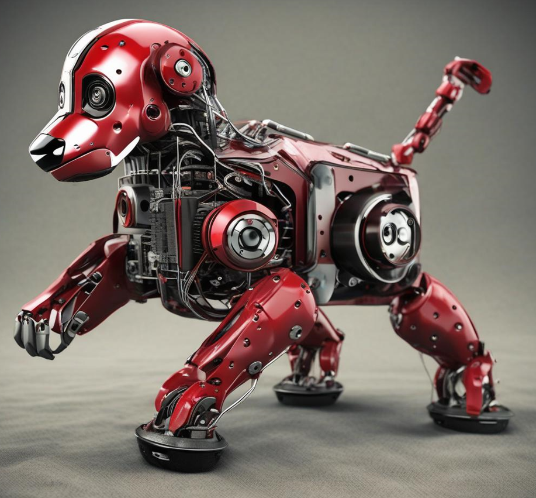

# Explorando os Recursos de IA Generativa com Copilot e OpenAI

## Qual o maior planeta avistado até hoje?

O maior planeta já avistado é o ROXs 42Bb, um corpo celeste gigantesco localizado a cerca de 440 anos-luz da Terra na constelação de Ofiúco. Ele é classificado como um planeta super-Júpiter, com um diâmetro estimado em cerca de 2,5 vezes o de Júpiter. Isso o torna um verdadeiro colosso entre os exoplanetas conhecidos até agora!
No entanto, há debates sobre se ROXs 42Bb é realmente um planeta ou uma anã marrom, já que sua massa está próxima do limite entre as duas categorias. De qualquer forma, ele é um exemplo fascinante dos extremos que o universo pode oferecer! Fascinante, não acha? 🌌✨

## Qual é a diferença entre um planeta e uma anã marrom?

A diferença entre um planeta e uma anã marrom está principalmente na massa, na forma como geram energia e nas condições de formação. Aqui vai uma explicação detalhada:
Planetas:
•	Definição: Um planeta é um corpo celeste que orbita uma estrela, é massivo o suficiente para ser esférico devido à sua gravidade, mas não é grande o suficiente para provocar reações de fusão nuclear em seu núcleo.
•	Energia: Planetas não produzem sua própria energia; eles refletem a luz de sua estrela-mãe.
•	Massa: Geralmente, têm massa menor que 13 vezes a de Júpiter, o suficiente para evitar a fusão do deutério (uma forma de hidrogênio).
Anãs Marrons:
•	Definição: Uma anã marrom é um objeto intermediário entre um planeta gigante gasoso e uma estrela, com massa suficiente para realizar fusão de deutério em algum momento de sua vida, mas insuficiente para sustentar a fusão do hidrogênio como uma estrela faz.
•	Energia: Apesar de não serem estrelas, as anãs marrons emitem uma pequena quantidade de energia, especialmente no infravermelho, devido à fusão limitada ou ao calor residual de sua formação.
•	Massa: Geralmente têm entre 13 e 80 vezes a massa de Júpiter, o que as coloca acima da faixa planetária, mas abaixo das estrelas mais leves.
Uma maneira simples de pensar nisso é que as anãs marrons estão no limite entre os mundos planetários e estelares, desempenhando um papel único no estudo da formação de sistemas estelares e planetários.

## Cria uma imagem de um cão robot?

    

Uma ferramenta de reconhecimento de texto (OCR) pode identificar e decodificar as informações das imagens. O sucesso do reconhecimento depende da clareza, do contraste, da linguagem utilizada e de como o texto foi estilizado.

## Como o OCR é aplicado em tecnologia robótica?

O OCR (Reconhecimento Óptico de Caracteres) é amplamente utilizado na tecnologia robótica para aprimorar a interação entre robôs e o ambiente. A leitura de Informações Ambientais: Robôs equipados com câmeras podem usar OCR para ler sinais, placas ou etiquetas, como em armazéns ou fábricas. Isso permite que identifiquem locais, produtos ou instruções específicas.

